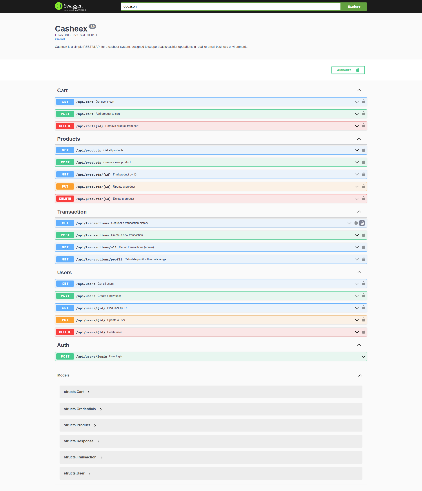

# 🧾 Casheex

Casheex adalah RESTful API sederhana untuk sistem kasir, cocok digunakan untuk skala toko retail kecil atau usaha mikro.



📍 Live Swagger UI:  
[https://casheex-production.up.railway.app/swagger/index.html](https://casheex-production.up.railway.app/swagger/index.html)

---

## 🚀 Fitur Utama

- Autentikasi JWT
- Manajemen User (CRUD)
- Manajemen Produk (CRUD)
- Keranjang belanja (Cart)
- Transaksi penjualan
- Perhitungan Laba

---

## 📦 Teknologi

- **Golang** + **Gin Web Framework**
- **Swagger (swaggo)** untuk dokumentasi API
- **JWT Auth** untuk proteksi endpoint
- **MySQL** sebagai database (tergantung konfigurasi)

---

## 🔐 Autentikasi

Hampir semua endpoint membutuhkan token JWT. Gunakan endpoint login untuk mendapatkan token dan sertakan dalam header:

```
Authorization: Bearer <your_token>
```

#### ✅ Default Credential (Akun Admin)
Gunakan akun berikut untuk login ke sistem:

```
Username: demo
Password: demo
```

> Kamu bisa mengubah atau menambahkan user baru melalui endpoint `/api/users`.

---

## 📚 Dokumentasi Swagger

Swagger UI tersedia untuk eksplorasi interaktif endpoint:
```
[GET]    /api/products         -> Get all products  
[POST]   /api/products         -> Create new product  
[GET]    /api/products/{id}    -> Get product by ID  
[PUT]    /api/products/{id}    -> Update product  
[DELETE] /api/products/{id}    -> Delete product  

[GET]    /api/cart             -> Get cart items  
[POST]   /api/cart             -> Add item to cart  
[DELETE] /api/cart/{id}       -> Remove item from cart  

[POST]   /api/transactions     -> Create a transaction  
[GET]    /api/transactions     -> Get user's transaction history  
[GET]    /api/transactions/all -> Get all transactions (admin)  
[GET]    /api/transactions/profit?start_date=...&end_date=... -> Get profit report  

[POST]   /api/users/login      -> Login (get token)  
[GET]    /api/users            -> Get all users  
[POST]   /api/users            -> Create user  
[GET]    /api/users/{id}       -> Get user by ID  
[PUT]    /api/users/{id}       -> Update user  
[DELETE] /api/users/{id}       -> Delete user  
```

---

## ⚙️ Cara Menjalankan

1. Clone repo:
   ```bash
   git clone https://github.com/username/casheex.git
   cd casheex
   ```

2. Buat `.env` atau `config.json` dan atur koneksi database serta secret JWT.

3. Jalankan server:
   ```bash
   go run main.go
   ```

4. Generate dokumentasi Swagger (jika perlu):
   ```bash
   swag init
   ```

---

## 🔄 Response Format

Semua response API berbentuk struktur JSON standar:

```json
{
  "message": "Deskripsi response",
  "error": null,
  "data": { ... }
}
```

---

## 👤 Role Akses

| Role      | Fitur Akses                            |
|-----------|----------------------------------------|
| Admin     | Semua fitur (user, transaksi, laporan) |
| Kasir     | Produk, cart, transaksi                |

---

## ✨ Kontribusi

Pull request terbuka untuk perbaikan bug, dokumentasi, atau fitur tambahan.
